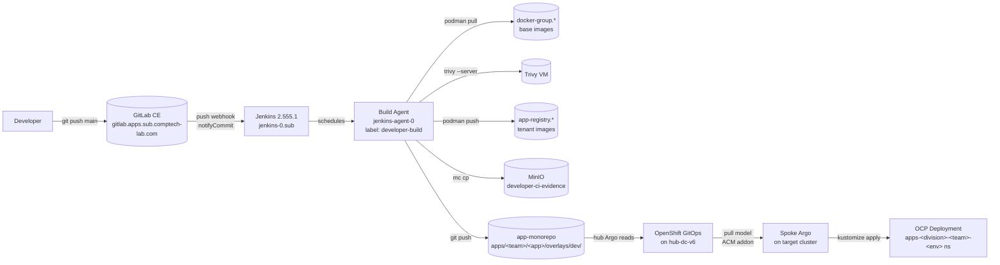

import Whiteboard from "../../../../components/Whiteboard";
import Mermaid from "../../../../components/Mermaid";

export const dev      = { background: "#fef3c7", border: "1px solid #b45309", borderRadius: 8, padding: 8,  color: "#1f2937", width: 150, textAlign: "center" };
export const ctrl     = { background: "#e5e7eb", border: "1px solid #6b7280", borderRadius: 8, padding: 10, color: "#1f2937", width: 180, textAlign: "center", fontWeight: 600 };
export const stage    = { background: "#fafafa", border: "1px solid #9ca3af", borderRadius: 8, padding: 8,  color: "#1f2937", width: 170, textAlign: "center" };
export const agent    = { background: "#fafafa", border: "1.5px dashed #15803d", borderRadius: 8, padding: 10, color: "#1f2937", width: 170, textAlign: "center" };
export const ext      = { background: "#dbeafe", border: "1px solid #1d4ed8", borderRadius: 8, padding: 8,  color: "#1f2937", width: 170, textAlign: "center" };

export const reqEdge  = { style: { stroke: "#1f2937", strokeWidth: 1.5 }, markerEnd: { type: "arrowclosed", color: "#1f2937" }, labelStyle: { fill: "#1f2937", fontSize: 11 }, labelBgStyle: { fill: "#fafafa" } };
export const muted    = { style: { stroke: "#6b7280" }, markerEnd: { type: "arrowclosed", color: "#6b7280" }, labelStyle: { fill: "#1f2937", fontSize: 11 }, labelBgStyle: { fill: "#fafafa" } };
export const evtEdge  = { style: { stroke: "#6d28d9", strokeWidth: 1.5 }, markerEnd: { type: "arrowclosed", color: "#6d28d9" }, labelStyle: { fill: "#6d28d9", fontSize: 11 }, labelBgStyle: { fill: "#fafafa" } };

export const sideA = [
  { id: "aTitle",  position: { x: 100, y:   0 }, data: { label: "Path A — Jenkins" }, style: { ...ctrl, background: "#fde68a", border: "1.5px solid #b45309" } },
  { id: "aDev",    position: { x:   0, y:  90 }, data: { label: "Developer" }, style: dev },
  { id: "aGit",    position: { x:   0, y: 180 }, data: { label: "GitLab project" }, style: stage },
  { id: "aJk",     position: { x:   0, y: 270 }, data: { label: "Jenkins controller\nnotifyCommit webhook" }, style: ctrl },
  { id: "aAg",     position: { x:   0, y: 380 }, data: { label: "jenkins-agent-0\n(VM)" }, style: agent },
  { id: "aTr",     position: { x: 200, y: 380 }, data: { label: "Trivy VM\nshared" }, style: stage },
  { id: "aNx",     position: { x:   0, y: 490 }, data: { label: "Nexus app-registry" }, style: stage },
  { id: "aMc",     position: { x: 200, y: 490 }, data: { label: "MinIO\ndeveloper-ci-evidence" }, style: stage },
  { id: "aMr",     position: { x:   0, y: 600 }, data: { label: "App GitOps repo\nMR: digest patch" }, style: stage },
];
export const sideAEdges = [
  { id: "a1", source: "aDev", target: "aGit", label: "git push", ...reqEdge },
  { id: "a2", source: "aGit", target: "aJk",  label: "webhook",  ...reqEdge },
  { id: "a3", source: "aJk",  target: "aAg",  label: "schedule", ...reqEdge },
  { id: "a4", source: "aAg",  target: "aTr",  label: "trivy --server", ...muted },
  { id: "a5", source: "aAg",  target: "aNx",  label: "podman push", ...reqEdge },
  { id: "a6", source: "aAg",  target: "aMc",  label: "mc cp", ...evtEdge },
  { id: "a7", source: "aAg",  target: "aMr",  label: "update-overlay-digest.sh", ...reqEdge },
];

export const sideB = [
  { id: "bTitle",  position: { x: 600, y:   0 }, data: { label: "Path B — Tekton" }, style: { ...ctrl, background: "#bbf7d0", border: "1.5px solid #15803d" } },
  { id: "bDev",    position: { x: 500, y:  90 }, data: { label: "Developer" }, style: dev },
  { id: "bGit",    position: { x: 500, y: 180 }, data: { label: "GitLab project" }, style: stage },
  { id: "bEL",     position: { x: 500, y: 270 }, data: { label: "Tekton EventListener\n(spoke-dc-v6 Route)" }, style: ctrl },
  { id: "bPL",     position: { x: 500, y: 380 }, data: { label: "PipelineRun pod\n(openshift-pipelines ns)" }, style: agent },
  { id: "bTr",     position: { x: 700, y: 380 }, data: { label: "Trivy VM\nshared" }, style: stage },
  { id: "bQy",     position: { x: 500, y: 490 }, data: { label: "Quay (in-cluster)" }, style: stage },
  { id: "bMc",     position: { x: 700, y: 490 }, data: { label: "MinIO\ndeveloper-ci-evidence" }, style: stage },
  { id: "bMr",     position: { x: 500, y: 600 }, data: { label: "App GitOps repo\nMR: digest patch" }, style: stage },
];
export const sideBEdges = [
  { id: "b1", source: "bDev", target: "bGit", label: "git push", ...reqEdge },
  { id: "b2", source: "bGit", target: "bEL",  label: "webhook",  ...reqEdge },
  { id: "b3", source: "bEL",  target: "bPL",  label: "PipelineRun", ...reqEdge },
  { id: "b4", source: "bPL",  target: "bTr",  label: "trivy --server", ...muted },
  { id: "b5", source: "bPL",  target: "bQy",  label: "buildah push", ...reqEdge },
  { id: "b6", source: "bPL",  target: "bMc",  label: "Task: mc-upload", ...evtEdge },
  { id: "b7", source: "bPL",  target: "bMr",  label: "Task: update-overlay-digest", ...reqEdge },
];

export const sideBySide = [...sideA, ...sideB];
export const sideBySideEdges = [...sideAEdges, ...sideBEdges];

This page is the operator and developer reference for **Path A** — the Jenkins-based build path. It is the first build path to land in the lab (Jenkins is already live; Tekton is staging). It is the OCP counterpart to the existing docker-runtime-vm Jenkins chain documented in `connection-details/jenkins.md`: same Jenkins service, same agent, same Trivy / Nexus / MinIO infrastructure, same operator credentials. **The only difference is the final step**: docker-runtime-vm deploys via SSH to a VM; OCP deploys via a Git commit that Argo picks up.

Tracked under:

- DEV-OCP-3A.1 (#187) — extend Jenkins build jobs to target OCP.
- DEV-OCP-3A.2 (#188) — Jenkins → GitOps overlay digest-patch step.

## Path A vs Path B — side-by-side

Before diving into Path A, here is the structural comparison against Path B (which Section 03-build-paths/02 covers in detail). Both paths land on the same digest patch in the same overlay file; the difference is **where the build runs** and **which image registry it pushes to**.

<Whiteboard client:load data={{ nodes: sideBySide, edges: sideBySideEdges }} height={720} />

| Aspect | Path A — Jenkins | Path B — Tekton |
|---|---|---|
| Build host | `jenkins-agent-0` VM, label `developer-build` | Per-build pod in `openshift-pipelines` namespace on `spoke-dc-v6` |
| Trigger | GitLab push webhook → Jenkins Git plugin `notifyCommit` URL | GitLab push webhook → Tekton `EventListener` Route |
| Webhook secret custody | Jenkins credential store (`git-notifycommit-<project>-token`) | Vault `secret/ocp/spoke-dc-v6/tekton/gitlab-webhook` → ESO Secret |
| Build tool | `podman` 4.9.3, `buildah` 1.33.7 | `buildah` Task in OpenShift Pipelines |
| Scan | `trivy --server` against the Trivy VM | `trivy --server` against the same Trivy VM |
| Image registry (push) | `app-registry.apps.sub.comptech-lab.com` (Nexus) | `quay.apps.sub.comptech-lab.com` (Quay) or Nexus fallback |
| Registry push credential | Jenkins credential store (`nexus-jenkinsbot`) | Vault `secret/apps/<division>/<app>/ci/quay-robot` → ESO Secret per tenant |
| Evidence target | MinIO bucket `developer-ci-evidence` | Same bucket, same prefix shape, same keys |
| Overlay patch step | `update-overlay-digest.sh` invoked on the agent, push via PAT | `update-overlay-digest` Tekton Task, push via ESO-materialised PAT |
| Argo sees | a new commit on `apps/<team>/<app>/overlays/dev/kustomization.yaml` | same |
| Migration A → B | supported; both paths terminate at the same digest patch | reverse migration (B → A) is **not** supported |

The defining symmetry: Argo CD reads `apps/<team>/<app>/overlays/dev/kustomization.yaml` and cannot tell which path produced the commit. That is the design intent — both paths are pluggable behind the same GitOps contract.

## Path A architecture



The build agent is a single, long-running VM with warm caches:

- Maven local repo (`~/.m2/repository`) — saves 30-90 seconds per Liberty/Spring build.
- Buildah layer cache — saves UBI base layer downloads.
- `/opt/claude-agent/scripts/` checkout — provides `update-overlay-digest.sh` and `promote.sh`.

For builds that benefit from the warm cache (Liberty + Maven, Spring Boot + Maven, Node.js + npm), Path A is faster cold-to-cold than a fresh Tekton pod. For builds that elastically scale across many cluster nodes, Path B's per-build pod model wins. The choice is captured in the [decision matrix](./06-path-decision-matrix).

## Tooling on `jenkins-agent-0`

| Tool | Version | Used for |
|---|---|---|
| OpenJDK | 21 | Maven, language build |
| Maven | recent stable | Liberty / Spring builds |
| Node.js / npm | recent stable | Node.js builds |
| Podman | 4.9.3 | Container image build (rootless), `podman login`, `podman push` |
| Buildah | 1.33.7 | Lower-level image build (when invoked directly) |
| Skopeo | 1.13.3 | Registry inspection (`skopeo inspect` to verify pushed digest) |
| Trivy | 0.70.0 | Scan client, server mode against the Trivy VM |
| MinIO client (`mc`) | recent stable | Evidence upload |
| `claude-agent/scripts/update-overlay-digest.sh` | versioned by repo HEAD | Overlay patch |
| `claude-agent/scripts/promote.sh` | versioned by repo HEAD | Dev → stg → prd promotion |

Skopeo presence was rechecked on 2026-05-09 and is at `/usr/bin/skopeo`. Trivy server URL is fronted by HAProxy on the Trivy VM.

## Credentials

All credentials referenced below live in the Jenkins credential store at `https://jenkins.apps.sub.comptech-lab.com/credentials/`. Local custody copies live under `codex-opp-agent/secrets/jenkins/` (Git-ignored). Do not paste values into this file, into tickets, or into chat.

| Credential ID | Type | Owner | Scope | Used for |
|---|---|---|---|---|
| `nexus-jenkinsbot` | Username + password | platform-admin | system | Pull base images from `docker-group.*`, push app images to `app-registry.*` |
| `trivy-server-token` | Secret text | platform-admin | system | Trivy server auth for the enforced CRITICAL gate |
| `minio-developer-ci-evidence` | Username + password | platform-admin | system | Scoped writer for `developer-ci-evidence` bucket |
| `gitlab-mavenbot-pat` | Username + password | platform-admin | system | GitLab PAT with `write_repository` scope on the app monorepo; pushes the overlay digest patch |
| `git-notifycommit-<project>-token` | Secret text | per project | per job | Gates the GitLab push webhook into Jenkins for a given tenant project |

`gitlab-mavenbot-pat` may be replaced by a dedicated `apps-overlay-bot` PAT scoped only to the app monorepo when the lab grows past the demo phase.

## Stages

The OCP-targeting Jenkins pipeline has eight user-visible stages plus a `post {}` cleanup block. Each stage has a deterministic failure signature.

### 1. Prepare Workspace

Verifies `podman`, `skopeo`, `trivy`, `mc`, and the `claude-agent` script set are present on the agent. Sets `XDG_RUNTIME_DIR` to a workspace-local directory so rootless Podman doesn't fight with other concurrent users on the agent.

| Symptom | Cause | Fix |
|---|---|---|
| `podman system info` fails | `XDG_RUNTIME_DIR` missing or wrong perms | The stage runs `install -d -m 0700 $WORKSPACE/.xdg-runtime`; persistent failure points at agent-side Podman corruption (rebuild or reinstall). |
| `claude-agent/scripts/update-overlay-digest.sh missing` | `/opt/claude-agent` checkout absent or stale | SSH to the agent, `git clone https://github.com/zeshaq/claude-agent.git /opt/claude-agent` (or `git -C /opt/claude-agent pull`). |

### 2. Checkout App Source

`checkout scm` against the tenant repo. The job's SCM credential is the read-only deploy token for that GitLab project (not the overlay-bot PAT — that's used only for the digest-patch push).

| Symptom | Cause | Fix |
|---|---|---|
| `Authentication failed` on `git fetch` | Job's SCM credential wrong | Jenkins job → Pipeline → Pipeline script from SCM → Credentials. Use the per-project read-only deploy token. |
| Webhook fires but no build starts | Polled trigger not registered yet | Trigger one manual build through the Jenkins UI to register the polled trigger. |

### 3. Registry Login

`podman login` against both `docker-group.*` and `app-registry.*` using `nexus-jenkinsbot`.

| Symptom | Cause | Fix |
|---|---|---|
| `denied: access forbidden` | Nexus role missing on `nexus-jenkinsbot` for the relevant repo | Operator: Nexus UI → Security → Users → jenkinsbot → roles. Required roles: `nx-developer-app-push` and `nx-developer-base-pull`. |
| TLS verification error | Nexus TLS cert rotated, agent has stale CA | `update-ca-trust` on agent; rerun. |

### 4. Build Image

Loads `lib/build-<LANGUAGE>.groovy` from the shared library and runs the language-specific build. This is the only stage that varies between Liberty / Node / Spring Boot.

| Symptom | Cause | Fix |
|---|---|---|
| `no Containerfile/Dockerfile in repo root` | Tenant repo missing build recipe | Tenant fix: add `Containerfile` at repo root that `FROM`s a base hosted on `docker-group.*`. |
| Maven artifact resolution fails | Maven `settings.xml` points outside lab Nexus group | Use lab `settings.xml` template from `examples/app-repo-template/`. |
| npm registry timeout | npm not pointed at lab proxy | Tenant fix: `npm config set registry https://npm-group.apps.sub.comptech-lab.com/` or commit `.npmrc`. |
| Language lib not found | Tenant repo didn't vendor shared library and `/opt/claude-agent` doesn't have sibling `codex-opp-agent/` checkout | Operator: clone `codex-opp-agent` next to `claude-agent` on the agent. |

### 5. Trivy Scan Gate

Saves the local image as a tar, runs Trivy in server mode against the Trivy VM, fails the pipeline on any CRITICAL CVE. Produces `trivy-scan.json` and `trivy-scan.txt`.

Severity policy (identical for both paths, codified in `ci-evidence-schema.md`):

| Severity | Action |
|---|---|
| CRITICAL | **Fail build.** No overlay patch MR is opened. Evidence still uploaded for triage. |
| HIGH | **Warn.** Build succeeds; `trivy-scan.json` captures the finding; DefectDojo (when present) flags for triage. |
| MEDIUM / LOW / UNKNOWN | Captured in JSON; no gate. |

| Symptom | Cause | Fix |
|---|---|---|
| Exit code 1, CRITICAL list in `trivy-scan.txt` | Real CVE in dependencies or base image | Tenant fix: bump dependency / base image, re-push. Pipeline stays strict. |
| `connection refused` to Trivy server | Trivy VM down or HAProxy backend stale | Operator: `curl -fsS https://trivy.apps.sub.comptech-lab.com/healthz`. If 502, check HAProxy `trivy-vm-be` backend; if backend down, SSH the Trivy VM. |
| Trivy hangs > 10 min | DB pull stalled on cold start | Operator: pre-warm DB on Trivy VM with `trivy image --download-db-only`. |

A CRITICAL failure is **not** a pipeline bug. The `post { unsuccessful {} }` block deletes the rejected image from Nexus so a vulnerable manifest is never addressable.

### 6. Push to Nexus app-registry

Pushes the locally-built image and captures the digest from both the local push and a `skopeo inspect` against the registry. The two must match; mismatch indicates registry rewriting.

| Symptom | Cause | Fix |
|---|---|---|
| `unauthorized: authentication required` mid-push | Token expired between login and push (rare) | `disableConcurrentBuilds()` is already on; verify no parallel job is running. |
| push digest != registry digest | Nexus rewriting manifests | Operator: check Nexus blob store storage; check that `docker-dev-hosted` is not behind an upstream proxy by accident. |
| `manifest blob unknown` | Layer push interrupted | Retry build; intermittent network. |

### 7. Publish Evidence to MinIO

Uploads `build.log`, `sbom.spdx.json`, `trivy-scan.json/.txt`, `image-digest.txt`, `image-registry-digest.txt` under `developer-ci-evidence/<team>/<app>/<git-sha>/`. Also archives the same artifacts on the Jenkins build.

The schema is codified in `ci-evidence-schema.md` (DEV-OCP-3.7, #195) and is identical between Path A and Path B.

| Symptom | Cause | Fix |
|---|---|---|
| `mc cp` returns 403 | `minio-developer-ci-evidence` user lost write policy | Operator: MinIO console, attach `developer-ci-evidence-writer` policy to user. |
| `mc cp` connection timeout | MinIO VM unreachable from agent | Operator: from agent, `nc -zv <minio-ip> 9000`; if blocked, check br30 routing. |

### 8. Patch GitOps Overlay

Clones the app monorepo, invokes:

```bash
claude-agent/scripts/update-overlay-digest.sh \
  team-<TEAM> <APP> <env> <digest>
```

and pushes the commit `bump: team-<TEAM>/<APP> <env> @<sha256-short>` to `APP_MONOREPO_BRANCH` (typically `ci/dev/<short-sha>`). The push uses `gitlab-mavenbot-pat` embedded into the clone URL on the fly; the token is **never** logged because the `sed` rewrite happens inside the shell step before the `git` call.

| Symptom | Cause | Fix |
|---|---|---|
| `ERROR: no 'digest: sha256:<64-hex>' line found` | Overlay file doesn't have a seed `digest:` line | Tenant fix: edit `overlays/<env>/kustomization.yaml`, add `images:` block with placeholder digest (see app-repo-contract). Re-run pipeline. |
| `ERROR: overlay kustomization not found` | `apps/<team>/<app>/overlays/<env>/` doesn't exist | Tenant fix: open overlay scaffold MR from `examples/app-repo-template/`. |
| `git push` rejected | Branch protected and overlay-bot not on allow list | Operator: GitLab → Settings → Repository → Push rules; add overlay-bot identity or grant `Maintainer` on project. |
| `Permission denied (publickey)` | PAT clone URL fell back to SSH | Verify `APP_MONOREPO_URL` is `https://...`, not `git@...`. |

### 9. Promote (optional)

Runs only when both `PROMOTE_FROM` and `PROMOTE_TO` are set on the build. Reuses the clone from stage 8, invokes:

```bash
claude-agent/scripts/promote.sh \
  team-<TEAM> <APP> <PROMOTE_FROM> <PROMOTE_TO>
```

and pushes `promote: team-<TEAM>/<APP> <from> @<sha> -> <to>`.

| Symptom | Cause | Fix |
|---|---|---|
| `no-op: <to> already pinned at @sha256:...` | Idempotent run, promotion already done | Nothing to do; script is by design idempotent. |
| `ERROR: no 'digest: sha256:...' entry found under images: in apps/.../<to-env>/kustomization.yaml` | Target overlay missing `images:` block | Tenant fix: seed target overlay first (one-off manual MR). |

## Argo sync after the push

Once the digest patch lands on `main`, the platform `ApplicationSet` (DEV-OCP-2.2 / #183) sees the new commit on its next refresh (default 3 minutes; can be forced with `argocd app get team-<TEAM>-<APP>-dev --refresh`). The Argo app then syncs the Deployment, which causes the kubelet to pull the new image by digest from Nexus.

| Symptom | Cause | Fix |
|---|---|---|
| Argo shows `OutOfSync` indefinitely | Spoke Argo can't pull from Nexus (cluster pull secret missing) | Operator: check `connection-details/app-registry-pullsecret.md`; ensure `apps-pull-secret` present in target namespace. |
| Argo shows `Synced / Healthy` but no rollout | Image digest unchanged in rendered manifest | `oc -n <ns> get deploy <app> -o yaml \| grep image:`. If digest matches but pods are old, `oc rollout restart deploy/<app>`. |
| Argo silent / not syncing at all | `gitops-addon` CRD collision (incident #153) | Operator: `oc delete crd routes.route.openshift.io` on the spoke. |

## Live validation

Live validation on 2026-05-09 of the existing `openliberty-readiness-probe-image-build` job (the docker-runtime variant that maps to the same chain):

- Build `#8` completed successfully
- Ran on `jenkins-agent-0`
- Cloned `divisions/sandbox/openliberty-readiness-probe`
- Pushed `app-registry.apps.sub.comptech-lab.com/smoke/readiness-probe:build-8`
- Enforced Trivy gate, archived reports, uploaded release evidence to MinIO
- Nexus returned HTTP `200` for the pushed manifest

The OCP variant of this job (with stage 8 and 9 enabled) shares all stages 1-7 with the docker-runtime variant. Migration is a job-template parameter change.

## When to choose Path A

Choose Path A when:

- The tenant already maintains a Jenkinsfile and a `developer-build` job that targets docker-runtime-vm; extending it to also write the GitOps patch is the lowest-effort change.
- The build needs tools that are easier to install once on `jenkins-agent-0` than to package into an OCP container (licensed compilers, large local caches).
- There is no requirement to run the build inside the target OpenShift cluster (no Tekton-based supply-chain attestation gate yet).
- The build benefits from warm `mvn` / `podman` layer caches.
- The team operates under an air-gapped change-window and wants the build to survive an OCP outage.

The full decision matrix with example apps is in [`06-path-decision-matrix.mdx`](./06-path-decision-matrix).

## Health-check commands

Cold-start sanity, run from any host that can resolve lab DNS and has `~/.netrc-jenkins` configured:

```bash
# Jenkins agent online?
curl --netrc-file ~/.netrc-jenkins -fsS \
  https://jenkins.apps.sub.comptech-lab.com/computer/jenkins-agent-0/api/json \
  | jq '{offline: .offline, idle: .idle}'

# Latest OCP-targeted build status (replace job name)?
curl --netrc-file ~/.netrc-jenkins -fsS \
  https://jenkins.apps.sub.comptech-lab.com/job/team-platform-sample-ocp-build/lastBuild/api/json \
  | jq '{number, result, duration, building}'

# Most recent overlay patch landed in the monorepo?
git -C /tmp/app-monorepo-check fetch --quiet origin main
git -C /tmp/app-monorepo-check log --oneline -5 origin/main \
  -- apps/team-platform/sample/overlays/dev/kustomization.yaml
```

## References

- `connection-details/jenkins-ocp-path.md` — operator-level reference for Path A (this page is the public-doc version)
- `connection-details/jenkins.md` — Jenkins service endpoint, credentials, smoke jobs
- `connection-details/app-repo-contract.md` — overlay shape this path writes to (#182)
- `connection-details/image-digest-overlay.md` — digest patch convention (#185)
- `connection-details/promotion-model.md` — build-once / promote-by-digest model (#184)
- `connection-details/ci-evidence-schema.md` — evidence schema (#195)
- `connection-details/nexus.md` — Nexus endpoint, roles
- `templates/jenkinsfiles/README.md` — Jenkinsfile templates and smoke tests
- `adr/0009-jenkins-single-vm.md` — why Jenkins is a single VM
- `adr/0014-developer-readiness-platform-contract.md`
- `adr/0018-acm-openshift-gitops-pull-model-v6.md`
- `adr/0019-nexus-only-image-supply-chain.md`
- DEV-OCP issues: #187 (extend Jenkins jobs to OCP), #188 (overlay digest-patch step)
