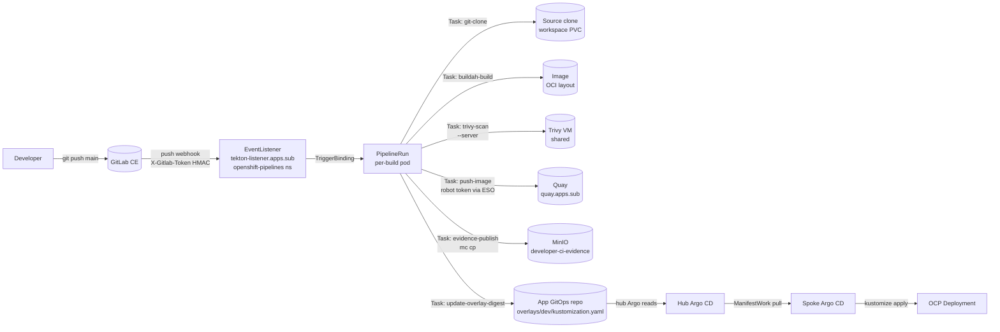

import Mermaid from "../../../../components/Mermaid";

This page is the operator and developer reference for **Path B** — the Tekton-based build path. It runs entirely inside OpenShift Pipelines on `spoke-dc-v6`. Path B is the future-direction path for greenfield apps and for any build that needs OpenShift-native event triggers or in-cluster image pushes.

Tracked under DEV-OCP-3B issues:

- #189 (DEV-OCP-3B.1) — Tekton Pipeline templates (Liberty / Node / Spring).
- #190 (DEV-OCP-3B.2) — Tekton EventListener + GitLab webhook secret.
- #191 (DEV-OCP-3B.3) — Tekton Trivy Task wrapping the Trivy VM API.
- #192 (DEV-OCP-3B.4) — Tekton git-cli Task to patch GitOps overlay.
- #193 (DEV-OCP-3B.5) — Tekton image push to Quay (per-team robot tokens via ESO).

For the structural comparison against Path A, see the side-by-side whiteboard on the [Path A page](./01-path-a-jenkins-trivy-nexus).

## Architecture



Each `PipelineRun` is a fresh per-build pod. Tasks are sequential by default in a Pipeline; parallel branches are explicit. The pod terminates when the PipelineRun completes; the per-build workspace lives on a PersistentVolumeClaim (Workspace) that is cleaned up by retention.

## Tasks (shared library)

The shared Task library lives in the `openshift-pipelines` namespace. Each Task is reusable across the three Pipeline flavours (Liberty / Node / Spring). Tasks are versioned by image tag and pinned in each Pipeline.

| Task | What it does | Inputs | Outputs |
|---|---|---|---|
| `git-clone` | Clones tenant repo into the workspace | `url`, `revision`, `subdirectory` | `commit` result (40-char SHA) |
| `buildah-build` | Runs `buildah bud` against the cloned source | `dockerfile`, `context`, `image-name` | `image-digest` (local) |
| `trivy-scan` | Posts built image to Trivy VM API for scan, fails on CRITICAL | `image-name`, `trivy-server-url`, `severity` | `scan-result` JSON |
| `push-image` | `buildah push` to Quay or Nexus, returns registry digest | `image-name`, `registry-secret` | `image-digest` (registry) |
| `evidence-publish` | Uploads `build.log`, `sbom.spdx.json`, `trivy-scan.json`, `image-digest.txt` to MinIO | `team`, `app`, `git-sha`, `minio-secret` | none |
| `update-overlay-digest` | Clones the app GitOps repo, patches overlay digest, opens MR | `team`, `app`, `env`, `digest`, `gitlab-bot-secret` | MR URL |

Per DEV-OCP-3B.1 (#189), three Pipelines are defined:

- `liberty-build-deploy`
- `node-build-deploy`
- `spring-build-deploy`

Each accepts the same parameter set:

```yaml
params:
  - name: app
  - name: team
  - name: git-revision
  - name: target-env
    default: dev
```

## EventListener and trigger

The GitLab webhook lands at:

```text
https://tekton-listener.apps.sub.comptech-lab.com/
```

This is an OpenShift Route in front of an `EventListener` in the `openshift-pipelines` namespace. The listener is gated by an HMAC secret in the `X-Gitlab-Token` header.

The wiring:

```yaml
apiVersion: triggers.tekton.dev/v1beta1
kind: EventListener
metadata:
  name: gitlab-listener
  namespace: openshift-pipelines
spec:
  triggers:
    - name: gitlab-push
      interceptors:
        - ref:
            name: gitlab
          params:
            - name: secretRef
              value:
                secretName: gitlab-webhook-secret
                secretKey: token
            - name: eventTypes
              value: ["Push Hook"]
      bindings:
        - ref: gitlab-push-binding
      template:
        ref: liberty-build-deploy-template
```

The HMAC secret `gitlab-webhook-secret` is materialised by ExternalSecret from Vault path `secret/ocp/spoke-dc-v6/tekton/gitlab-webhook` (DEV-OCP-3B.2 / #190). It is never committed to Git and never stored on a VM filesystem.

`TriggerBinding` (per Pipeline) maps the GitLab payload into Pipeline parameters:

```yaml
apiVersion: triggers.tekton.dev/v1beta1
kind: TriggerBinding
metadata:
  name: gitlab-push-binding
  namespace: openshift-pipelines
spec:
  params:
    - name: git-revision
      value: $(body.checkout_sha)
    - name: git-repo-url
      value: $(body.repository.git_http_url)
    - name: git-repo-name
      value: $(body.project.path_with_namespace)
```

The `TriggerTemplate` for each flavour stamps out a `PipelineRun` with the bound parameters.

## Credentials and ServiceAccount model

Path B uses cluster-internal ServiceAccounts. No long-lived push credentials live on a VM.

| Secret | Source | Materialised in | Consumed by |
|---|---|---|---|
| GitLab webhook HMAC (`gitlab-webhook-secret`) | Vault `secret/ocp/spoke-dc-v6/tekton/gitlab-webhook` | `openshift-pipelines` namespace via ESO | EventListener interceptor |
| Quay robot token (`quay-robot-team-<team>`) | Vault `secret/apps/<division>/<app>/ci/quay-robot` | `openshift-pipelines` namespace via tenant `vault-apps` SecretStore + template | `push-image` Task |
| GitLab bot PAT (`gitlab-bot-team-<team>`) | Vault `secret/apps/<division>/<team>/gitlab-bot` | `openshift-pipelines` namespace via ESO | `update-overlay-digest` Task |
| MinIO writer (`minio-developer-ci-evidence`) | Vault `secret/platform/minio/developer-ci-evidence` | `openshift-pipelines` namespace via ESO | `evidence-publish` Task |
| Trivy server token (`trivy-server-token`) | Vault `secret/platform/trivy/server-token` | `openshift-pipelines` namespace via ESO | `trivy-scan` Task |

The per-tenant Quay robot token convention is critical: each team gets its own Quay Organization (`team-<team>`) and a robot account with push permission on its own org only. The robot token is delivered into the `openshift-pipelines` namespace as a Secret named `quay-robot-team-<team>`, and the shared `push-image` Task accepts the Secret name as a parameter so it can be reused unchanged across tenants.

## Pipeline shape (example: Liberty)

```yaml
apiVersion: tekton.dev/v1
kind: Pipeline
metadata:
  name: liberty-build-deploy
  namespace: openshift-pipelines
spec:
  params:
    - name: app
    - name: team
    - name: git-revision
    - name: target-env
      default: dev
  workspaces:
    - name: source
    - name: dockerconfig
  tasks:
    - name: clone
      taskRef:
        name: git-clone
      params:
        - name: url
          value: $(params.git-repo-url)
        - name: revision
          value: $(params.git-revision)
      workspaces:
        - name: output
          workspace: source

    - name: build
      runAfter: [clone]
      taskRef:
        name: buildah-build
      params:
        - name: dockerfile
          value: Containerfile
        - name: image-name
          value: quay.apps.sub.comptech-lab.com/team-$(params.team)/$(params.app):$(params.git-revision)
      workspaces:
        - name: source
          workspace: source

    - name: scan
      runAfter: [build]
      taskRef:
        name: trivy-scan
      params:
        - name: image-name
          value: $(tasks.build.results.image-name)
        - name: severity
          value: CRITICAL

    - name: push
      runAfter: [scan]
      taskRef:
        name: push-image
      params:
        - name: image-name
          value: $(tasks.build.results.image-name)
        - name: registry-secret
          value: quay-robot-team-$(params.team)
      workspaces:
        - name: dockerconfig
          workspace: dockerconfig

    - name: evidence
      runAfter: [push]
      taskRef:
        name: evidence-publish
      params:
        - name: team
          value: $(params.team)
        - name: app
          value: $(params.app)
        - name: git-sha
          value: $(params.git-revision)

    - name: patch-overlay
      runAfter: [evidence]
      taskRef:
        name: update-overlay-digest
      params:
        - name: team
          value: $(params.team)
        - name: app
          value: $(params.app)
        - name: env
          value: $(params.target-env)
        - name: digest
          value: $(tasks.push.results.image-digest)
        - name: gitlab-bot-secret
          value: gitlab-bot-team-$(params.team)
```

Each Task has a `runAfter` so the order is deterministic. A CRITICAL Trivy finding fails the `scan` Task, which fails the PipelineRun, which short-circuits `push`, `evidence`, and `patch-overlay`.

## Image registry — Quay with per-team robots

The Path B push target is `quay.apps.sub.comptech-lab.com`. Each team gets:

- a Quay Organization named `team-<team>`
- a Quay Robot account with push permission on that org only
- the Robot token stored in Vault at `secret/apps/<division>/<app>/ci/quay-robot`
- an ExternalSecret materialising the token as a Kubernetes `kubernetes.io/dockerconfigjson` Secret named `quay-robot-team-<team>` in the `openshift-pipelines` namespace

Image namespace convention:

```text
quay.apps.sub.comptech-lab.com/team-<team>/<app>:<git-sha>
quay.apps.sub.comptech-lab.com/team-<team>/<app>@sha256:<digest>
```

The push response carries the registry digest; the digest is the result of the `push-image` Task and the input to `update-overlay-digest`.

### Why Quay (vs Nexus app-registry)

- **No long-lived push credential on a VM.** The robot token lives in Vault and is materialised into a cluster Secret on demand.
- **Workload Identity binding.** Tekton ServiceAccount + the dockerconfig Secret bind to Quay without per-job credential injection.
- **Quay SBOM + Clair scan results** appear in the Quay UI as a complement to the Trivy gate.
- **Cluster-native.** Path B's target lives inside the same cluster as the build; the network path is loopback-ish (HAProxy edge for cross-cluster pull, but the build pushes to the local Quay).

For tenants that cannot use Quay yet (because Quay is not yet GA in the lab), Path B falls back to Nexus app-registry — same shape, different hostname. The overlay's `images:` block adjusts accordingly.

## Trivy

Path B uses the **same** Trivy VM as Path A. There is no per-path scan engine. The `trivy-scan` Task posts the built image reference to the Trivy VM API in server mode:

```bash
trivy image \
  --server https://trivy.apps.sub.comptech-lab.com \
  --severity CRITICAL \
  --format json \
  --output trivy-scan.json \
  $IMAGE_NAME
```

A CRITICAL finding exits non-zero, which fails the Task, which fails the Pipeline. The full report (all severities) is also emitted for downstream consumers (DefectDojo, audit).

Trivy DB freshness: Path B's `trivy-scan` Task runs an init step that pulls the DB from the internal mirror before scanning. The Trivy VM itself refreshes the DB nightly; the init step is a safety net for cluster pods that don't have the DB cached.

## Evidence

The `evidence-publish` Task uploads to MinIO under the same prefix shape Path A uses:

```text
developer-ci-evidence/<team>/<app>/<git-sha>/
  build.log
  sbom.spdx.json
  trivy-scan.json
  image-digest.txt
```

Same keys, same shapes, same severity policy. A downstream consumer reading evidence cannot tell which path produced the build.

`sbom.spdx.json` is generated by `syft` (in Path B's case, a `syft` Task that runs after `build` and before `scan`). The SBOM is SPDX 2.3 JSON of the final image.

## Overlay patch (`update-overlay-digest` Task)

The `update-overlay-digest` Task:

1. Clones the app GitOps repo using a GitLab bot PAT delivered via ESO.
2. Runs `claude-agent/scripts/update-overlay-digest.sh <team> <app> <env> <digest>` (the same script Path A uses on the Jenkins agent).
3. `git add` + `git commit -m "bump: team-<team>/<app> <env> @<short-digest>"`.
4. `git pull --rebase` to handle concurrent pushes (race-safe).
5. `git push origin ci/<env>/<short-sha>`.
6. Optionally opens a Merge Request via GitLab API.

The script is idempotent: re-running with the same digest exits 0 without a second commit.

The MR is opened with the same title shape Path A uses (`bump: team-<team>/<app> <env> @<sha256-short>`), so Argo's view of history is path-agnostic.

## Path B vs Path A — what changes for the developer

| Aspect | Path A | Path B |
|---|---|---|
| Where do I look at the build log? | Jenkins UI (`https://jenkins.apps.sub.comptech-lab.com/job/...`) | OpenShift console → Pipelines → PipelineRuns, or `tkn pipelinerun logs` |
| Where does my image live? | `app-registry.apps.sub.comptech-lab.com/<team>/<app>` | `quay.apps.sub.comptech-lab.com/team-<team>/<app>` |
| What is my registry credential? | Jenkins-side `nexus-jenkinsbot` (shared) | Per-tenant Quay robot token (ESO-materialised) |
| How do I retry a failed build? | Re-trigger from Jenkins UI | `tkn pipelinerun start` or push a no-op commit |
| Does my code change anywhere? | No; the Jenkinsfile lives in a template repo | No; the Pipeline lives in `openshift-pipelines` shared library |
| What does the GitOps repo look like? | Identical | Identical |

## Failure modes and gotchas

| Symptom | Cause | Fix |
|---|---|---|
| EventListener Route returns 404 | Route not created in `openshift-pipelines` ns | `oc -n openshift-pipelines get route tekton-listener`; recreate if missing. |
| `X-Gitlab-Token` rejected | HMAC secret in Vault doesn't match GitLab webhook config | Verify ESO materialised the Secret; verify webhook secret in GitLab matches. |
| Buildah Task OOMs | Per-pod memory request too small for a Liberty build | Bump `resources.requests.memory` on the Task; the Pipeline's `taskRunSpec` overrides Task default. |
| Trivy Task `connection refused` | Trivy VM unreachable from `spoke-dc-v6` | Operator: check NetworkPolicy egress; check HAProxy `trivy-vm-be`. |
| Push to Quay 401 | Robot token expired or ESO not refreshing | Operator: rotate Quay robot token in Vault; force ESO re-sync. |
| `update-overlay-digest` push rejected | GitLab bot PAT scope wrong | Verify PAT has `write_repository` on the target app GitOps repo. |
| Same digest re-pushed loops Argo | App GitOps repo is the source of truth, but the registry GC removed the digest | Don't GC digests referenced from `main`; configure Quay retention to keep digests in the overlay tree. |

## Migration A → B

A team can migrate from Path A to Path B with no GitOps-side change. The mechanical steps (per `build-path-matrix.md`):

1. Open an issue under the tenant onboarding milestone, link both the existing Jenkins job and the target Tekton namespace.
2. Clone the existing Jenkins job's stages: checkout, build, scan, push, evidence-upload, overlay-patch.
3. Recreate each stage as a Tekton Task using the shared library templates.
4. Wire stages into a `Pipeline` and add a `PipelineRun` template plus the relevant `EventListener` / `TriggerBinding`.
5. Run both paths in parallel for one release cycle; confirm evidence parity via `scripts/evidence-validator.py`.
6. Disable the Jenkins job (do not delete; keep for rollback for 30 days).
7. Update the onboarded-apps table in `build-path-matrix.md`.

The reverse migration (B → A) is **not** supported. Once an app moves to Tekton, do not build a new Jenkinsfile for it. If a Tekton path fails, fix the Tekton path; do not regress.

## References

- `connection-details/build-path-matrix.md` (#194) — decision matrix and migration rules
- `connection-details/ci-evidence-schema.md` (#195) — evidence parity contract
- `connection-details/app-repo-contract.md` (#182) — overlay shape
- `connection-details/image-digest-overlay.md` (#185) — digest convention
- `connection-details/promotion-model.md` (#184) — build-once / promote-by-digest
- `connection-details/image-registry-allowlist.md` (#186) — Quay added to allowlist
- `adr/0018-acm-openshift-gitops-pull-model-v6.md`
- `adr/0019-nexus-only-image-supply-chain.md`
- DEV-OCP issues: #189, #190, #191, #192, #193, #195
- Memory: `reference_quay_robot_token_convention` (Vault path + Secret naming pattern)
