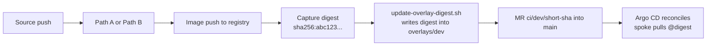
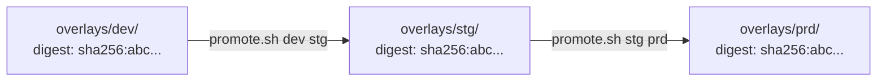

This page describes the release model that ties Path A, Path B, and the GitOps consume side together: **a single built image is promoted unchanged through `dev → stg → prd` by Git-only operations**. Tracked under DEV-OCP-2.3 (#184) and DEV-OCP-2.4 (#185); the source-of-truth file is `connection-details/promotion-model.md`.

This page also documents the overlay-patch mechanics (the per-build commit that bumps a digest), because the patch shape is what makes promotion a copy-the-digest-forward operation.

## The principle

A single built image artifact is promoted **unchanged** through `dev → stg → prd`.

The artifact is identified by its immutable content digest (`sha256:<64hex>`), never by a mutable tag. Once a build is accepted into `dev`, the **same** digest is what moves forward — no rebuild, no re-tag, no re-push between environments.

The shape this takes in Git:

```yaml
# apps/<team>/<app>/overlays/dev/kustomization.yaml
images:
  - name: app-registry.apps.sub.comptech-lab.com/<team>/<app>
    newName: app-registry.apps.sub.comptech-lab.com/<team>/<app>
    digest: sha256:abc123def...

# apps/<team>/<app>/overlays/stg/kustomization.yaml
images:
  - name: app-registry.apps.sub.comptech-lab.com/<team>/<app>
    newName: app-registry.apps.sub.comptech-lab.com/<team>/<app>
    digest: sha256:abc123def...   # same digest as dev

# apps/<team>/<app>/overlays/prd/kustomization.yaml
images:
  - name: app-registry.apps.sub.comptech-lab.com/<team>/<app>
    newName: app-registry.apps.sub.comptech-lab.com/<team>/<app>
    digest: sha256:abc123def...   # same digest as stg
```

All three overlays reference an image **by digest**. Promotion is the act of copying that digest forward, one Git commit at a time.

## Why build-once, not build-per-env

| Property | Build-once | Build-per-env |
|---|---|---|
| Reproducibility | Bits running in prd = bits scanned at build = bits validated in dev. | Three different sets of bits with separate scans; "it worked in stg" drift is structural. |
| Supply-chain auditability | A digest is a content hash. "What is running in prd" = "what was scanned at build time". | Three scans for three images; provenance fragments. |
| RHACS scan continuity | Same digest carries the same scan result. | Re-tagging or rebuilding invalidates the prior scan and forces a re-scan. |
| Single source of truth | The overlay's `digest:` is authoritative; one ledger. | Need a separate "release tag" registry, or a parallel ledger of which tag points where. |
| Promotion friction | One small Git MR. | Re-running a full build pipeline per env. |
| Rollback | One Git MR pinning the previous known-good digest. | Either re-run the old build or restore from a tagged artifact. |

The lab's PCI-aligned compliance path (`compliance-implementor-handbook.md`) explicitly requires the build-once model for the supply-chain audit story to hold together.

## Anti-patterns

These are not allowed:

- **Mutable tags (`:latest`, `:stable`, `:prod`) in any overlay.** Always digest. The image digest convention (DEV-OCP-2.4 / #185) is enforced by linter on production overlays.
- **Re-tagging an image in the registry as part of promotion.** Promotion is a Git operation, not a registry operation. The registry is a content-addressed store; the digest is the only stable handle.
- **Editing `stg/` or `prd/` overlays directly from a CI job.** Only `promote.sh` (run by a human, against the app-monorepo working copy) writes those.
- **Rebuilding from source when promoting.** If the source has changed, that is a new `dev/` digest landing via Path A or Path B — not a promotion.

## The build-to-`dev` flow



The build path stops at `dev/`. Neither Path A nor Path B ever writes to `stg/` or `prd/` directly.

### The overlay patch — one-line model

The change CI applies on every build:

```diff
 # overlays/dev/kustomization.yaml
 images:
   - name: app-registry.apps.sub.comptech-lab.com/<team>/<app>
     newName: app-registry.apps.sub.comptech-lab.com/<team>/<app>
-    digest: sha256:OLD_DIGEST...
+    digest: sha256:NEW_DIGEST_FROM_BUILD...
```

That is the entire diff. The script (`ops-workspace/scripts/update-overlay-digest.sh <team> <app> <env> <digest>`) implements:

1. Locate `apps/<team>/<app>/overlays/<env>/kustomization.yaml`.
2. Find the `images:` block; locate the matching `name:` entry.
3. Replace the `digest:` line with the new value.
4. Validate by parsing the YAML; if invalid, abort.
5. `git add` + `git commit -m "bump: <team>/<app> <env> @<sha256-short>"`.
6. `git push` to the `ci/<env>/<short-sha>` branch.
7. Optionally open a Merge Request.

The script is idempotent: re-running with the same digest produces no second commit.

## The promotion flow

Promotion `dev → stg` (and later `stg → prd`) is a small MR that **copies the digest** from the previous overlay into the next overlay's `kustomization.yaml`. There is no rebuild, no re-tag, and no registry write.



### The `promote.sh` script

```bash
ops-workspace/scripts/promote.sh <team> <app> <from-env> <to-env>

# example
promote.sh platform myapp dev stg
```

The script:

1. Reads `apps/<team>/<app>/overlays/<from-env>/kustomization.yaml`.
2. Extracts the `digest:` from the `images:` block.
3. Updates `apps/<team>/<app>/overlays/<to-env>/kustomization.yaml` with that same digest.
4. `git add` + `git commit -m "promote: <team>/<app> <from-env> @<sha256-short> -> <to-env>"`.
5. `git push` to the `promote/<team>-<app>-<from>-to-<to>-<short-sha>` branch.

It is idempotent: re-running when the target overlay already matches is a no-op that exits 0.

### Commit messages

Deterministic shapes for both flows:

| Flow | Commit message |
|---|---|
| Build → dev | `bump: <team>/<app> dev @<sha256-short>` |
| Promote dev → stg | `promote: <team>/<app> dev @<sha256-short> -> stg` |
| Promote stg → prd | `promote: <team>/<app> stg @<sha256-short> -> prd` |
| Rollback prd → dev's prior digest | `promote: <team>/<app> prd @<old-sha256-short> -> prd` (manual edit, same shape) |

The `<sha256-short>` is the first 8 hex chars; the overlay always carries the full 64-char form.

`git log --grep '^promote: <team>/<app>'` is a release history for one app.

## When to bump

- A new `dev/` digest lands automatically when Path A / Path B push a fresh build and the team merges the auto-opened MR. (The MR is auto-opened, not auto-merged.)
- `stg/` and `prd/` only bump when the team manually opens a promotion MR using `promote.sh`. There is no scheduled or automatic promotion.
- Rollback is the same operation in reverse: open a promotion MR pinning the previous known-good digest. Because every digest still exists in the registry (per retention), rollback is just another small kustomize patch.

## Retention guarantees

For the build-once model to support rollback, **digests referenced from `main` must not be garbage-collected** from the registry. Both Nexus and Quay are configured with retention policies that keep digests referenced from the GitOps tree.

| Registry | Retention rule |
|---|---|
| Nexus `docker-dev-hosted` | `docker-dev-hosted-retain-30d`; keep last 30 days of tags, but a digest is referenced via the manifest pinning, so the underlying blob is retained as long as any tag references it. |
| Nexus `docker-group` proxies | `docker-proxy-retain-14d`; base-image cache only, no app images. |
| Quay (per-team org) | Retention via Quay's tag-expiration policy; the digest tag (`@sha256:...`) is never auto-expired. |

Drift indicator: an Argo sync fails with `manifest blob unknown` for a digest that is on `main`. Treat as a registry-side incident; the digest must be retained.

## How Kustomize resolves the patch

`kustomize build overlays/<env>` walks the base and rewrites every `spec.containers[].image` whose value matches `name:` to `<newName>@<digest>`. The rendered Deployment therefore contains:

```yaml
spec:
  template:
    spec:
      containers:
        - name: sample
          image: app-registry.apps.sub.comptech-lab.com/team-platform/sample@sha256:abc123...
```

No tag survives into the rendered manifest. Argo CD applies this rendered manifest to the cluster, and the kubelet pulls strictly by digest.

## Validation

A digest is present on every image in the rendered overlay if and only if every line emitted by:

```bash
kustomize build apps/<team>/<app>/overlays/<env> \
  | grep -E "^\s+image:"
```

contains an `@sha256:` separator. A grep for a literal `:` *not* preceded by `@sha256` is a useful negative check:

```bash
kustomize build apps/<team>/<app>/overlays/prd \
  | grep -E "^\s+image:" \
  | grep -v "@sha256:" \
  && { echo "FAIL: tag-pinned image found"; exit 1; } \
  || echo "OK: all images digest-pinned"
```

CI for production overlays (the `<division>-gitops` validation pipeline) fails the build if the second grep matches anything.

## End-to-end: a worked promotion

A real day-in-the-life:

1. Developer pushes commit `3f4781f2` to `divisions/payments/payments-apps-monorepo` on branch `main`.
2. Path A (or B) builds, scans, pushes image `app-registry.apps.sub.comptech-lab.com/team-checkout/checkout@sha256:abc12345...`.
3. CI opens MR `ci/dev/3f4781f2` against `payments-gitops`: bumps `apps/checkout/overlays/dev/kustomization.yaml` digest to the new `sha256:abc12345...`.
4. Team merges. Argo CD on `spoke-dc-v6` reconciles `apps-payments-checkout-dev` namespace; pods roll over.
5. Smoke tests pass in dev. Team is ready to promote to stg.
6. Engineer runs `promote.sh checkout dev stg` in their app-monorepo working copy. Opens MR `promote/payments-checkout-dev-to-stg-3f4781f2`.
7. Release approver reviews; approves; merges. Argo reconciles `apps-payments-checkout-stg`; same `sha256:abc12345...` pod image.
8. Smoke tests pass in stg. Time to promote to prd.
9. Engineer runs `promote.sh checkout stg prd`. Opens MR `promote/payments-checkout-stg-to-prd-3f4781f2`.
10. Release approver + security reviewer approve; MR merges. Argo reconciles `apps-payments-checkout-prd`; same digest pod image.

At every environment, `kubectl get deploy checkout -o jsonpath='{.spec.template.spec.containers[0].image}'` returns the **same digest**. The audit answer to "what shipped to prod on date X" is the `promote: ... -> prd` commit, and the digest in that commit links directly to the build-time scan in MinIO.

## Failure modes and gotchas

| Symptom | Cause | Fix |
|---|---|---|
| `update-overlay-digest.sh` reports `ERROR: no 'digest: sha256:...' line found` | Overlay `images:` block missing | Seed overlay with the template `images:` block; re-run. |
| `promote.sh` reports `no-op: <to-env> already pinned at @sha256:...` | Idempotent run | Nothing to do. |
| `promote.sh` reports `ERROR: no 'digest:' entry found under images: in apps/.../<to-env>/kustomization.yaml` | Target overlay missing `images:` block | Seed target overlay first (one-off manual MR). |
| Argo `Synced / Healthy` but pods are old | Image digest unchanged in rendered manifest | Verify `oc -n <ns> get deploy <app> -o yaml \| grep image:` matches the new digest; if not, the overlay patch didn't land — re-check the MR was merged into `main`, not just into a branch. |
| `manifest blob unknown` at kubelet pull | Registry retention removed the digest | Restore the image from build artifacts (the Jenkins archive or Tekton workspace); rebuild from the same commit if necessary; never let `main` reference a deleted digest. |
| Tag-pinned image survived to prd | Validation pipeline missing or skipped | Add the `grep -v @sha256` check to `<division>-gitops` CI; fail the merge until corrected. |
| Mass rollback after a bad release | A single bad digest reached `prd` | One `promote.sh` invocation per app per env back to the previous digest; each is a small reviewed MR. The blast radius is per-app. |

## References

- `connection-details/promotion-model.md` (#184) — full source-of-truth
- `connection-details/image-digest-overlay.md` (#185) — overlay patch convention
- `connection-details/app-repo-contract.md` (#182) — overlay shape this depends on
- `connection-details/build-path-matrix.md` (#194) — both paths terminate at the same patch
- DEV-OCP issues: #184 (build-once / promote-by-digest), #185 (digest patch convention)
- `adr/0019-nexus-only-image-supply-chain.md`
- `connection-details/compliance-implementor-handbook.md` — supply-chain audit requirements
