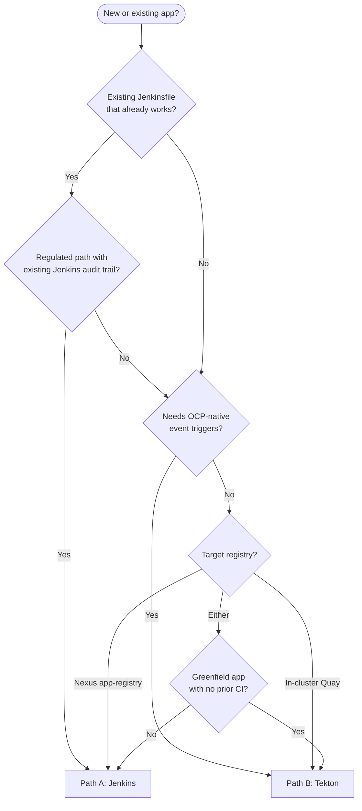

import Mermaid from "../../../../components/Mermaid";

This page is the public-doc version of `connection-details/build-path-matrix.md` (DEV-OCP-3.6 / #194). Use it when a new app is being onboarded and the team is deciding which build path to use.

The platform supports two parallel build paths that terminate at the same GitOps contract (digest-pinned overlay patch — see [Build-Once / Promote-by-Digest](./05-build-once-promote-by-digest)):

- **Path A — Jenkins** on `jenkins-0.sub.comptech-lab.com`, build agent `jenkins-agent-0`, image pushed to **Nexus app-registry** (`app-registry.apps.sub.comptech-lab.com`).
- **Path B — Tekton (OpenShift Pipelines)** on `spoke-dc-v6`, image pushed to **in-cluster Quay** (`quay.apps.sub.comptech-lab.com`) when present, falling back to Nexus app-registry.

Both paths emit the same evidence schema, enforce the same Trivy severity policy, and write the same digest-pinned overlay patch MR.

## Default rule

**Teams choose.** There is no platform-imposed default. Pick the path that fits the app today; migrate later under the rules below if needs change.

If a team has no opinion and asks for guidance, the recommendation is:

- **Path A (Jenkins)** for any existing Open Liberty / Maven app with an existing `Jenkinsfile`.
- **Path B (Tekton)** for any greenfield app whose trigger surface is OpenShift-native rather than just `git push`.

## Recommendation scenarios

| Scenario | Recommended path | Why |
|---|---|---|
| Existing Liberty / Maven app with a mature `Jenkinsfile` | A (Jenkins) | Reuses proven pipeline; no rewrite cost; audit history continuous. |
| New greenfield app, OCP-native eventing needs | B (Tekton) | Tekton Triggers can fire on cluster events (ConfigMap change, Image push, custom CRD), not just git push. |
| App that needs triggers from cluster events (not just git push) | B (Tekton) | Path A has no in-cluster trigger surface. |
| App in a regulated path with an existing Jenkins audit trail | A (Jenkins) | Existing audit / change-control evidence keeps its lineage; no continuity gap. |
| App that pushes to in-cluster Quay (more secure path) | B (Tekton) | Tekton ServiceAccount + ESO-materialised robot token binds to Quay without long-lived push credentials on a VM. |
| App pushing to Nexus app-registry only | A (Jenkins) | Jenkins agent already holds the Nexus push credential and Skopeo + Trivy + MinIO `mc` are all installed. |
| App needs `mvn` + `podman build` on a long-running VM (warm cache) | A (Jenkins) | `jenkins-agent-0` keeps Maven local repo + Buildah layers warm; faster than cold Tekton pod each run. |
| App build runs > 30 min and benefits from elastic per-build pods | B (Tekton) | Each PipelineRun is a fresh pod; horizontal scale across cluster nodes. |
| App is a tenant onboarding pilot with no prior CI | B (Tekton) | Demonstrates OCP-native flow end to end; no extra VM dependency. |
| Air-gapped change-window build with no live OpenShift API access | A (Jenkins) | Jenkins VM survives an OCP outage; can ship images to Nexus when cluster is unreachable. |

## Operator decision tree

## Worked example apps

Three example apps and the rationale for their assigned path. These are illustrative onboarding cases that exercise the decision tree end to end.

### Example 1 — `team-platform / readiness-probe` (Path A)

**App profile**

- Open Liberty starter; Maven build; existing `Jenkinsfile`.
- Targets a known-good image base on `docker-group.*` (ICR Open Liberty kernel).
- No cluster-event triggers — pushes on `main` trigger the build.
- Push target: Nexus app-registry.

**Why Path A**

- The Jenkinsfile already builds and pushes to docker-runtime-vm. Adding stage 8 (overlay-patch) is one credential and one shell step — the lowest-effort change.
- Maven local repo on `jenkins-agent-0` shortens build time vs a cold Tekton pod.
- The team has a continuous audit trail in Jenkins build history that they want preserved.

**Onboarding evidence**

- Live-validated on 2026-05-09: build `#8` of `openliberty-readiness-probe-image-build` completed; image `app-registry.apps.sub.comptech-lab.com/smoke/readiness-probe:build-8` pushed; Nexus returned HTTP 200 on the manifest endpoint; evidence uploaded to MinIO `developer-ci-evidence`.

**Path A specifics**

- Credentials: `nexus-jenkinsbot` for image push; `trivy-server-token` for scan; `minio-developer-ci-evidence` for evidence; `gitlab-mavenbot-pat` for the overlay patch push.
- Webhook: GitLab → `notifyCommit` on Jenkins, gated by `git-notifycommit-readiness-probe-token`.

### Example 2 — `team-payments / checkout-api` (Path B)

**App profile**

- Greenfield Spring Boot API for a payments division.
- Trigger surface includes ConfigMap watch (new config layouts arrive via GitOps and should trigger a re-deploy of dependent services); native event trigger needed.
- Push target: in-cluster Quay (no long-lived push credential allowed on a VM by division security policy).
- Build resource profile: occasional 30-45 min full integration test runs that benefit from per-build pod elasticity.

**Why Path B**

- The native event trigger requirement disqualifies Path A (Jenkins `notifyCommit` is git-push-only).
- Division security policy forbids VM-resident long-lived registry push credentials. Path B's per-tenant Quay robot token (delivered via ESO into a per-build pod) satisfies this.
- The integration test run scales horizontally with per-build pod elasticity rather than queuing on one Jenkins agent.

**Onboarding pattern**

- Quay Organization: `team-payments`. Robot account with push on that org. Robot token stored in Vault at `secret/apps/payments/checkout-api/ci/quay-robot`. ExternalSecret materialises the token as Kubernetes `dockerconfigjson` Secret `quay-robot-team-payments` in `openshift-pipelines` namespace.
- EventListener URL: `https://tekton-listener.apps.sub.comptech-lab.com/`; HMAC secret from `secret/ocp/spoke-dc-v6/tekton/gitlab-webhook`.
- Pipeline: `spring-build-deploy` from the shared library (DEV-OCP-3B.1 / #189). Parameters: `team=payments`, `app=checkout-api`, `git-revision=$GIT_SHA`, `target-env=dev`.

**Path B specifics**

- Image namespace: `quay.apps.sub.comptech-lab.com/team-payments/checkout-api`.
- Overlay digest patch from the `update-overlay-digest` Task using `gitlab-bot-team-payments` Secret (Vault-sourced).

### Example 3 — `team-risk / model-runner` (Path B → migration from Path A)

**App profile**

- Node.js service that runs a risk-scoring model.
- Started life on Path A six months ago; the team has accumulated a Jenkinsfile with several custom stages (model-artifact pre-fetch, smoke-eval).
- Recently added a requirement: trigger a model-runner rebuild whenever an upstream feature-store ConfigMap changes. This requirement is the migration trigger.

**Why migrate A → B**

- The ConfigMap-watch trigger is a Tekton primitive (Triggers + CEL filter on `ConfigMap` add/update). Path A would need a polling job to detect the change; Path B reacts immediately.
- The team wanted to keep the model-artifact pre-fetch as a Tekton Task and gained the side benefit of standardised RBAC.

**Migration steps (followed `build-path-matrix.md`)**

1. Opened issue under tenant onboarding milestone, linked both the existing Jenkins job and the target Tekton namespace.
2. Cloned existing Jenkins stages: checkout, build, scan, push, evidence-upload, overlay-patch.
3. Recreated each stage as a Tekton Task using the shared library; the model-artifact pre-fetch became a new custom Task `model-prefetch`.
4. Wired Tasks into a Pipeline and added a `PipelineRun` template + ConfigMap-trigger EventListener.
5. Ran both paths in parallel for one release cycle; confirmed evidence parity by running `scripts/evidence-validator.py` against both prefixes for the same `<git-sha>`.
6. Disabled the Jenkins job (kept for rollback for 30 days; deleted after).
7. Updated the onboarded-apps table in `build-path-matrix.md`.

**Path B specifics**

- Pipeline: `node-build-deploy` from the shared library + custom `model-prefetch` Task.
- Migration time: ~2 weeks elapsed (most of it waiting for one release cycle of parallel runs).
- Reverse migration (B → A) is not supported. If a Tekton-side defect surfaces, the team fixes it forward in Tekton; they do not write a new Jenkinsfile.

## Onboarded apps table

Populated as teams onboard. Empty initially; copies of the live table live in `build-path-matrix.md`.

| Team | App | Path | Onboarded | Last build | Notes |
|---|---|---|---|---|---|
| _(none yet)_ |   |   |   |   |   |

When onboarding a new app, append a row in the same MR that adds the app to the division's GitOps repo.

## Migration rules

### A → B (Jenkins to Tekton): supported

1. Open an issue under the tenant onboarding milestone, link both the existing Jenkins job and the target Tekton namespace.
2. Clone the existing Jenkins job's stages: checkout, build, scan, push, evidence-upload, overlay-patch.
3. Recreate each stage as a Tekton `Task` using the shared library.
4. Wire stages into a `Pipeline` and add a `PipelineRun` template plus the relevant `EventListener` / `TriggerBinding`.
5. Run both paths in parallel for one release cycle; confirm evidence parity via the validator.
6. Disable the Jenkins job (do not delete; keep for rollback for 30 days).
7. Update the onboarded-apps table.

### B → A (Tekton to Jenkins): NOT supported

There is no reverse migration. Once an app has moved off Jenkins, do not build a new Jenkinsfile for it. If a Tekton path fails, fix the Tekton path; do not regress.

Rationale: keeping the migration one-directional prevents a slow drift back toward VM-anchored CI for OCP-native workloads. Jenkins remains in scope for apps that started on Path A and for any Path-A-only scenarios above.

## Cross-path parity (the safety net)

The choice is low-stakes because both paths guarantee:

| Guarantee | What it means |
|---|---|
| Same MinIO evidence prefix shape | `developer-ci-evidence/<team>/<app>/<git-sha>/` regardless of path. |
| Same required evidence blob set | `build.log`, `sbom.spdx.json`, `trivy-scan.json`, `image-digest.txt`. |
| Same Trivy severity policy | Fail on CRITICAL, warn on HIGH. |
| Same digest-pinned overlay patch | Same `images:` block format, same `digest: sha256:...` line. |
| Same MR-into-`main` flow | Same branch naming (`ci/dev/<short-sha>`), same commit message shape. |

A path that cannot meet all five is not a supported path and must not be onboarded.

The implication: a migration A → B is **invisible to Argo CD and to downstream consumers**. The team experiences the change; the rest of the platform does not.

## Failure modes and gotchas

| Symptom | Cause | Fix |
|---|---|---|
| Team picks Path B but their build needs warm Maven cache | Mismatch with decision tree | Re-evaluate; Path A is the better fit. Per-build pods do not retain Maven local repo across runs. |
| Team picks Path A but security policy forbids VM-resident push credential | Mismatch with security policy | Re-evaluate; Path B with ESO-materialised robot tokens fits. |
| Team is told "use Path A by default" or "use Path B by default" | Operator drift; no platform-imposed default | Restate the decision tree; the platform recommendation is the team's choice within the matrix. |
| Migration A → B halfway done, both paths firing | Forgot step 5 (parallel-then-disable) | Disable Jenkins job; only Tekton fires for new pushes. |
| Team requests B → A migration | Reverse migration not supported | Fix the Tekton-side issue instead. |

## References

- `connection-details/build-path-matrix.md` (#194) — full source-of-truth
- `connection-details/ci-evidence-schema.md` (#195) — parity contract
- `connection-details/jenkins-ocp-path.md` (#187/#188) — Path A operator runbook
- `connection-details/promotion-model.md` (#184) — what both paths land into
- DEV-OCP issues: #187, #188 (Path A); #189, #190, #191, #192, #193 (Path B); #194 (this matrix); #195 (parity)
